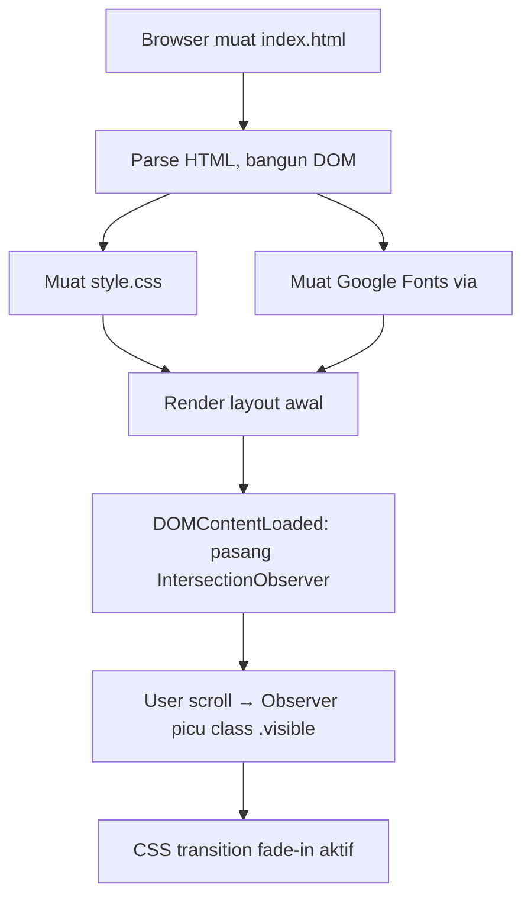

# Design Document — Izaura Landing Page

## Overview

Landing page statis satu halaman (`index.html` + `style.css`) untuk mempromosikan dua produk unggulan: **Air Izaura** (air minum kemasan) dan **Black Garlic** (suplemen herbal). Halaman dirancang agar dapat di-deploy langsung tanpa server backend, mudah diedit oleh non-developer, responsif di semua ukuran layar, dan memenuhi standar aksesibilitas WCAG 2.1 Level AA.

Stack teknologi:
- **HTML5** semantik (tanpa framework)
- **CSS3** murni dengan custom properties (variabel CSS) untuk warna dan tipografi
- **Vanilla JavaScript** minimal untuk smooth scroll dan fade-in on scroll via `IntersectionObserver`
- **Google Fonts** (Poppins) dengan fallback `sans-serif`
- Tidak ada build tool, tidak ada dependency npm, tidak ada library eksternal >10KB

---

## Architecture

Halaman diorganisir sebagai dokumen HTML tunggal dengan struktur linier top-to-bottom. Semua style berada di `style.css`, semua interaksi ringan berada di blok `<script>` di bagian bawah `index.html` (bukan file terpisah agar deployment tetap sederhana).

```
izaura/
├── index.html        ← Struktur HTML + <script> inline minimal
├── style.css         ← Seluruh aturan CSS
└── assets/           ← (opsional) folder untuk gambar produk asli
    ├── air-izaura.jpg
    └── black-garlic.jpg
```

### Alur render halaman



### Prinsip desain arsitektur

1. **Progressive Enhancement** — semua konten (teks, gambar, link) harus terlihat dan berfungsi tanpa JavaScript aktif.
2. **Separation of Concerns** — HTML hanya struktur; CSS hanya presentasi; JS hanya perilaku scroll/animasi.
3. **Configurable by comment** — setiap nilai yang perlu diganti pemilik (nomor WA, nama IG, src Maps, alamat, harga) ditandai dengan komentar HTML langsung di atasnya.
4. **No horizontal overflow** — semua elemen menggunakan `box-sizing: border-box` dan gambar menggunakan `max-width: 100%`.

---

## Components and Interfaces

### 1. `<head>` — Meta & Resources

```html
<meta charset="UTF-8">
<meta name="viewport" content="width=device-width, initial-scale=1.0">
<meta name="description" content="Air Izaura & Black Garlic — produk unggulan untuk keluarga Anda">
<title>Air Izaura & Black Garlic</title>
<link rel="preconnect" href="https://fonts.googleapis.com">
<link rel="stylesheet" href="https://fonts.googleapis.com/css2?family=Poppins:wght@400;600;700&display=swap">
<link rel="stylesheet" href="style.css">
```

Catatan: `display=swap` memastikan teks tetap terlihat dengan fallback font saat Google Fonts sedang dimuat.

### 2. Hero Section (`#hero`)

**Tanggung jawab:** Menjadi section pertama visible above the fold; menampilkan branding Air Izaura dan CTA utama.

**Elemen kunci:**
| Elemen | Tag | Isi |
|---|---|---|
| Judul utama | `<h1>` | "Air Izaura - Kesegaran Alami untuk Keluarga Anda" |
| Sub-headline | `<p>` | Teks yang menyebut: murni, higienis, terpercaya |
| Gambar produk | `` | Placeholder min 300×300px, alt deskriptif |
| CTA Button | `<a href="#contact">` | "Pesan Sekarang" |

**Layout desktop (≥768px):** dua kolom — teks di kiri (50%), gambar di kanan (50%).  
**Layout mobile (<768px):** satu kolom — teks di atas, gambar di bawah.

**Warna:** background `#EFF6FF` atau `#DBEAFE` (biru muda); teks heading `#1E40AF`; CTA button `#2563EB`.

### 3. Black Garlic Section (`#black-garlic`)

**Tanggung jawab:** Mempromosikan produk Black Garlic dengan visual yang berbeda secara intens dari Hero Section.

**Elemen kunci:**
| Elemen | Tag | Isi |
|---|---|---|
| Heading | `<h2>` | "Black Garlic - Suplemen Herbal Alami" |
| Deskripsi | `<p>` | Manfaat: antioksidan tinggi, peningkatan imun; maks 300 karakter |
| Gambar produk | `` | Placeholder min 250×250px rasio 1:1 |
| Card harga | `<div class="price-card">` | Teks harga yang dapat diedit langsung di HTML |

**Layout desktop:** gambar di kiri, teks+card di kanan (masing-masing ~50%).  
**Layout mobile:** satu kolom vertikal.

**Warna:** background `#92400E` atau `#78350F` (cokelat tua); aksen teks/border `#D4A843` (keemasan); teks putih `#FFFFFF`.

### 4. Contact Section (`#contact`)

**Tanggung jawab:** Menyediakan tombol WhatsApp dan Instagram sebagai saluran pembelian.

**Elemen kunci:**
| Elemen | Tag | Isi |
|---|---|---|
| Heading | `<h2>` | "Hubungi Kami" |
| Tombol WA | `<a href="https://wa.me/62...">` | Ikon WA + nomor, `target="_blank"`, min 44×44px |
| Tombol IG | `<a href="https://instagram.com/...">` | Ikon IG + nama akun, `target="_blank"`, min 44×44px |

**Ikon:** menggunakan karakter SVG inline atau Unicode untuk menghindari dependensi library icon eksternal.

**Validasi konfigurasi (JavaScript):** Jika `href` tombol WA mengandung placeholder `62xxxxxxxxxx` tanpa penggantian, atau jika `href` tombol IG mengandung `<nama_akun>` literal, tombol disembunyikan secara programatik agar tidak tampil sebagai link invalid.

### 5. Location Section (`#location`) & Footer

**Tanggung jawab:** Menampilkan peta Google Maps dan alamat toko; footer dengan copyright.

**Elemen kunci:**
| Elemen | Tag | Atribut kunci |
|---|---|---|
| Heading | `<h2>` | "Lokasi Kami" |
| Peta | `<iframe>` | `loading="lazy"`, `src` configurable, min 300×300px |
| Fallback peta | `<p class="map-fallback">` | "Peta akan ditampilkan di sini" (terlihat jika iframe src kosong) |
| Alamat | `<address>` | Teks maks 200 karakter |
| Footer | `<footer>` | `© <span id="year"></span> Air Izaura` |

**Tahun dinamis:** `document.getElementById('year').textContent = new Date().getFullYear();`

### 6. Scroll Behavior & Animasi (JavaScript)

**Smooth scroll CTA:**
```javascript
document.querySelector('.cta-button')?.addEventListener('click', (e) => {
  e.preventDefault();
  const target = document.querySelector('#contact');
  if (target) {
    target.scrollIntoView({ behavior: 'smooth', block: 'start' });
  }
  // Jika #contact tidak ada: tidak ada error, click diabaikan gracefully
});
```

**Fade-in on scroll (IntersectionObserver):**
```javascript
const observer = new IntersectionObserver((entries) => {
  entries.forEach(entry => {
    if (entry.isIntersecting) {
      entry.target.classList.add('visible');
    }
  });
}, { threshold: 0.2 });

document.querySelectorAll('.fade-in-section').forEach(el => observer.observe(el));
```

**CSS untuk animasi:**
```css
.fade-in-section {
  opacity: 0;
  transform: translateY(20px);
  transition: opacity 0.5s ease, transform 0.5s ease;
}
.fade-in-section.visible {
  opacity: 1;
  transform: translateY(0);
}
@media (prefers-reduced-motion: reduce) {
  .fade-in-section,
  .fade-in-section.visible {
    opacity: 1;
    transform: none;
    transition: none;
  }
}
```

---

## Data Models

Halaman ini statis — tidak ada backend atau state management. "Data" adalah nilai yang dikonfigurasi langsung di HTML via komentar penanda:

| Nilai | Lokasi di HTML | Format |
|---|---|---|
| Nomor WhatsApp | `href` pada `<a>` tombol WA | `https://wa.me/62{10-13 digit}` |
| Nama akun Instagram | `href` pada `<a>` tombol IG | `https://instagram.com/{1-30 karakter}` |
| Src iframe Google Maps | atribut `src` pada `<iframe>` | URL embed Google Maps |
| Teks alamat | konten `<address>` | Plain text, maks 200 karakter |
| Harga Black Garlic | konten elemen di dalam `.price-card` | Plain text, format bebas |
| Tahun copyright | diisi otomatis via JS | `new Date().getFullYear()` |

### CSS Custom Properties (Variabel Warna & Font)

Semua token desain didefinisikan di `:root` untuk kemudahan editing:

```css
:root {
  /* Tipografi */
  --font-primary: 'Poppins', sans-serif;

  /* Warna Air Izaura */
  --color-blue-primary: #2563EB;
  --color-blue-light: #EFF6FF;
  --color-blue-heading: #1E40AF;

  /* Warna Black Garlic */
  --color-brown-dark: #92400E;
  --color-gold-accent: #D4A843;

  /* Warna Umum */
  --color-white: #FFFFFF;
  --color-text-body: #374151;

  /* Ukuran */
  --touch-target-min: 44px;
  --border-radius: 8px;
}
```

---

## Correctness Properties

*A property is a characteristic or behavior that should hold true across all valid executions of a system — essentially, a formal statement about what the system should do. Properties serve as the bridge between human-readable specifications and machine-verifiable correctness guarantees.*

### Property 1: Format URL WhatsApp

*Untuk setiap* nomor WhatsApp yang dikonfigurasi (string digit 10–15 karakter), atribut `href` tombol WhatsApp harus berformat tepat `https://wa.me/62{nomor}` dan atribut `target` harus bernilai `_blank`.

**Validates: Requirements 3.3**

### Property 2: Format URL Instagram

*Untuk setiap* nama akun Instagram yang dikonfigurasi (string 1–30 karakter tanpa spasi), atribut `href` tombol Instagram harus berformat tepat `https://instagram.com/{nama_akun}` dan atribut `target` harus bernilai `_blank`.

**Validates: Requirements 3.5**

### Property 3: Touch target aksesibilitas

*Untuk setiap* elemen tombol interaktif yang dirender (CTA button, tombol WhatsApp, tombol Instagram), dimensi rendered width dan height masing-masing harus ≥ 44px.

**Validates: Requirements 3.6, 5.5**

### Property 4: Tidak ada overflow horizontal pada mobile

*Untuk setiap* nilai viewport width antara 320px dan 767px, tidak ada elemen HTML yang memiliki rendered offsetLeft + offsetWidth melebihi viewport width (tidak ada horizontal scrollbar).

**Validates: Requirements 5.1**

### Property 5: Gambar responsif tidak melebihi container

*Untuk setiap* elemen `` di halaman, CSS computed `max-width` harus bernilai `100%` dan `height` harus `auto`, sehingga gambar tidak pernah melebihi lebar container induknya.

**Validates: Requirements 5.4**

### Property 6: Font konsisten di semua elemen teks

*Untuk setiap* elemen teks yang dirender (heading, paragraf, tombol), computed `font-family` harus mengandung `Poppins` atau fallback `sans-serif` — tidak ada elemen yang menggunakan font selain dari daftar tersebut.

**Validates: Requirements 6.1**

### Property 7: Warna keemasan eksklusif untuk Black Garlic Section

*Untuk setiap* elemen yang berada di luar `#black-garlic` section, computed `background-color`, `color`, dan `border-color` tidak boleh berada dalam rentang warna keemasan/cokelat yang didefinisikan (`#D4A843`, `#92400E`, `#78350F`, dan variannya).

**Validates: Requirements 6.3**

### Property 8: Rasio kontras WCAG 2.1 AA

*Untuk setiap* elemen teks dengan `font-size` < 24px (setara 18pt), rasio kontras antara warna teks (`color`) dan warna latar belakang (`background-color`) harus ≥ 4.5:1.

**Validates: Requirements 6.4**

### Property 9: Animasi dihormati prefers-reduced-motion

*Untuk setiap* elemen dengan CSS animation atau transition, ketika media query `(prefers-reduced-motion: reduce)` aktif, nilai computed `transition-duration` dan `animation-duration` harus bernilai `0s` atau `none`.

**Validates: Requirements 7.5**

### Property 10: Tidak ada inline style di HTML

*Untuk setiap* elemen di dalam `<body>` dokumen `index.html`, tidak boleh ada atribut `style` pada elemen tersebut, dan tidak boleh ada elemen `<style>` di dalam dokumen.

**Validates: Requirements 8.1, 8.2**

### Property 11: Komentar konfigurasi hadir di semua nilai yang dapat diedit

*Untuk setiap* nilai yang dapat dikonfigurasi (nomor WA, nama akun IG, src iframe Maps, teks alamat, teks harga), harus ada komentar HTML (`<!-- ... -->`) yang secara eksplisit menyebutkan nilai tersebut perlu diganti, terletak langsung sebelum atau pada elemen yang bersangkutan.

**Validates: Requirements 8.3, 8.4**

---

## Error Handling

| Skenario | Behavior yang Diharapkan | Implementasi |
|---|---|---|
| `#contact` tidak ada saat CTA diklik | Tidak ada error, click diabaikan | Optional chaining `?.` + guard `if (target)` |
| Google Fonts gagal dimuat | Font fallback `sans-serif` tampil | CSS `font-family` stack dengan fallback |
| Gambar produk tidak ditemukan | Alt text deskriptif tampil, layout tidak rusak | Atribut `alt` wajib non-empty + `max-width: 100%` |
| Nomor WA tidak dikonfigurasi (kosong/placeholder) | Tombol WA tidak ditampilkan | JS check: sembunyikan jika href masih placeholder |
| Nama IG tidak dikonfigurasi (kosong/placeholder) | Tombol IG tidak ditampilkan | JS check: sembunyikan jika href masih placeholder |
| Src iframe kosong | Fallback teks "Peta akan ditampilkan di sini" | CSS + JS: tampilkan `.map-fallback` jika `src` kosong |
| JavaScript dinonaktifkan | Semua konten, gambar, tautan tetap terlihat dan berfungsi | Initial CSS state tanpa class `.visible` sudah visible (animasi hanya enhancement) |
| `prefers-reduced-motion` aktif | Semua animasi dan transisi dihilangkan | `@media (prefers-reduced-motion: reduce)` di `style.css` |

---

## Testing Strategy

### Pendekatan Pengujian

Karena ini adalah halaman statis HTML+CSS+minimal JS, pendekatan pengujian menggunakan **dua lapisan**:

1. **Unit/Example tests** — verifikasi struktur DOM, atribut, teks, dan CSS untuk skenario spesifik
2. **Property-based tests** — verifikasi invariant universal yang berlaku untuk semua input yang valid

### Property-Based Testing

**Library yang digunakan:** [fast-check](https://github.com/dubzzz/fast-check) (JavaScript, ~50KB tapi hanya untuk test environment, tidak dibundle ke halaman)

**Runtime:** Node.js + jsdom (untuk simulasi DOM tanpa browser)

**Konfigurasi minimum:** 100 iterasi per property test

Setiap property test harus diberi tag komentar:
```javascript
// Feature: izaura-landing-page, Property {N}: {deskripsi singkat}
```

**Property tests yang diimplementasikan:**

| Property | Test | Arbitraries |
|---|---|---|
| Property 1 (Format URL WA) | Generate string digit 10-15 karakter → verifikasi href | `fc.stringOf(fc.digit(), {minLength: 10, maxLength: 13})` |
| Property 2 (Format URL IG) | Generate string username valid → verifikasi href | `fc.stringOf(fc.char(), {minLength: 1, maxLength: 30})` |
| Property 3 (Touch target) | Render halaman → cek semua tombol interaktif | Snapshot DOM + jsdom computed style |
| Property 4 (No overflow mobile) | Simulasi viewport 320-767px → cek overflow | `fc.integer({min: 320, max: 767})` |
| Property 5 (Gambar responsif) | Cek semua img → computed max-width | Snapshot DOM |
| Property 6 (Font konsisten) | Cek semua elemen teks → computed font-family | Snapshot DOM |
| Property 7 (Warna eksklusif BG) | Cek semua elemen di luar `#black-garlic` | Snapshot DOM + color parser |
| Property 8 (Kontras WCAG) | Generate warna foreground/background → hitung rasio | `fc.tuple(fc.hexaString({minLength:6,maxLength:6}), ...)` |
| Property 9 (prefers-reduced-motion) | Simulasi media query aktif → cek transition: none | CSS parser + jsdom |
| Property 10 (No inline style) | Parse HTML → cek setiap elemen | HTML parser (parse5) |
| Property 11 (Komentar konfigurasi) | Parse HTML → cek komentar sebelum configurable values | HTML parser |

### Unit/Example Tests

Menggunakan **Vitest** (lightweight, kompatibel Node.js) + **jsdom**:

```
tests/
├── structure.test.js     ← Keberadaan section, heading, meta tags
├── content.test.js       ← Teks eksak, label tombol, alt text
├── contact.test.js       ← Validasi nomor WA kosong, akun IG kosong
├── location.test.js      ← Iframe, fallback peta, footer tahun
└── responsive.test.js    ← Viewport meta tag, gambar CSS
```

Contoh test:
```javascript
// structure.test.js
it('Hero section adalah section pertama di halaman', () => {
  const sections = document.querySelectorAll('section');
  expect(sections[0].id).toBe('hero');
});

it('Heading utama mengandung teks produk Air Izaura', () => {
  const h1 = document.querySelector('#hero h1');
  expect(h1.textContent).toContain('Air Izaura');
});
```

### Accessibility Testing

- **Automated:** axe-core dijalankan via Vitest untuk deteksi masalah aksesibilitas umum (kontras, alt text, label)
- **Manual:** Verifikasi navigasi keyboard (Tab order) dan pembacaan screen reader pada heading hierarchy (`h1` → `h2`) perlu dilakukan secara manual
- **Full WCAG validation:** Membutuhkan pengujian manual dengan assistive technology (NVDA, VoiceOver) dan review ahli aksesibilitas

### Cara Menjalankan Tests

```bash
# Install dependencies (hanya untuk testing, tidak dibundle ke halaman)
npm install --save-dev vitest jsdom fast-check axe-core parse5

# Jalankan unit tests sekali
npx vitest run

# Jalankan property tests (100 iterasi per property)
npx vitest run tests/properties/
```
